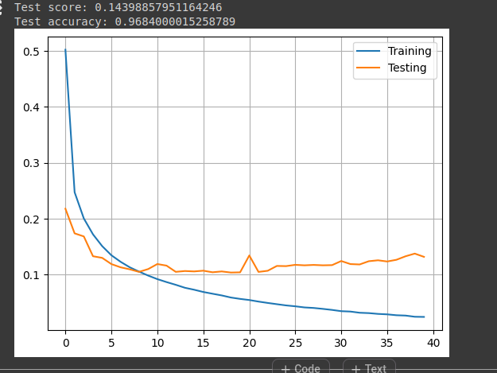

Lab 04: Deep Neural Networks
Shyshmarov Alexandre - Pinto da Cunha da Mata Guilherme

# 2. Digit recogni on from raw data

Select a final model (e.g., the one with best performance) for analysis (please, see below the summary of work to know what to include in the report)

```
Pour mon model final j'ai modifié par rapport au model de base :
    La structure de réseau de neuron. J'ai ajouté une deuxième couche cachée, j'ai changé le nombre de neuron (il est a 30 maintenant) et la fonction d'activation, c'est la relu maintenant

    J'ai modifié le nombre d'epoch. On est a 10 alors qu'avant, on était a 3
```

1. What is the learning algorithm being used to optimize the weights of the neural
networks?

```
RMSprop.
Etant donnée que l'algo n'a pas de parametre il utlise les parametre par défaut :
learning_rate = 0.001 / rho = 0.9 / epsilon = 1e-7 / etc..

La loss fonction est categorical_crossentropy
```
2. For each experiment excepted the last one (shallow network learning from raw data, shallow network learning from features and CNN)

    1. Select a neural network topology and describe the inputs, indicate how many are they, and how many outputs?
    2. Compute the number of weights of each model (e.g., how many weights between the input and the hidden layer, how many weights between each pair of layers, biases, etc..) and explain how do you get to the total number of weights.
```
Pour le model que j'ai sélectionner avant :

Il y a 784 inputs ce qui correspond à une image 28x28. Il y a 30 neurones sur la couche input + les biais de chaque neurone. On est à 23550 paramètres.
La seconde couche a 30 neurones et a une fonction d'activation relu. Avec 30 entré par neurones et 30 neurones au total on est à 900 paramètres + 30 biais.
La couche output a 10 neurones qui correspond aux 10 chiffres qu'on veut prédire. Et a softmax comme fonction d'activation. Chaque neurone sur cette couche a 30 entrées ce qui fait 300 paramètres + 10 biais.

Le total : Input = 30 * 784 + 30 / Hidden = 30 * 30 + 30 / Output = 30 * 10 + 10
```
3. Test at least three different meaningful cases
    
```
Quand je change le nombre d'input à 3, le model confond :
5 avec 0 / 5 avec 8 / 8 avec 2 / 8 avec 5 / 9 avec 7
```


```
La courbe est pas trop mal, on peut également voir qu'on a une loss qui est plutôt grande. Ce qui est assez mauvais pour un modèle.
```


```
La matrice de confusion reflète ce qui a été dit plus haut. Certains nombres ont du mal a été reconnu par notre modèle.
```

```
Quand j'augment le nombre de couche caché à 3 couches , le model confond :
3 avec 9 / 8 avec 2 / 8 avec 3 / 9 avec 7
```


```
On peut voir que le modèle est meilleur que celui avant, mais on voit que partir de 7 epoch on commence à voir de l'overfitting. Au niveau de la loss, elle est bien mieux qu'avant et l'accuracy est presque à 1.
```


```
La matrice de confusion est presque parfaite, si ce ne sont quelques chiffres qui posent toujours problème.
```

```
Quand j'augmente le nombre d'epoch a 40 , le model confond :
1 avec 6 / 2 avec 8 / 3 avec 5 / 9 avec 4 
```



```
On a très clairement un gros problème d'overfitting dès le début.
```


```
Malgré l'overfitting vu juste avant, la matrice est plutôt pas mal. Mais si, on test le modèle sur une autre dataset, on aurait sûrement des résultats un peu moins bien.
```

# 3. Digit recogni on from features of the input data

1. What is the learning algorithm being used to optimize the weights of the neural networks?
```
RMSprop c’est une variante de la descente de gradient stochastique.
```
   1. What are the parameters (arguments) being used by that algorithm?
    ```
    Comme on a aucune valeurs explicite, on utilise les valeurs par défaut. 
    Learning_rate : 0.001
    Rho : 0.9
    Momentum : 0.0
    Epsilon : 1e-7
    Centered : false
    Use_ema :false
    Ema_momentum : 0.99
    Ema_overwrite_frquency : None

    https://keras.io/api/optimizers/rmsprop/
    ```
   2. What loss function is being used ?
   ```
    categorical_crossentropy
    ```
   3. Please, give the equation(s)
    ```
    CE = - ∑p dp log(yp)
    ```
2. For each experiment excepted the last one (shallow network learning from raw data, shallow network learning from features and CNN)
    1. Select a neural network topology and describe the inputs, indicate how many are they, and how many outputs?

    ```
    La topologie du réseau neuronal est un réseau peu profond (shallow network) avec une couche cachée de 2 neurones et une couche de sortie de 10 neurones correspondant aux classes de sortie (les chiffres de 0 à 9).

    Le nombre de sorties est égal au nombre de classes dans le problème de  classification. Comme il s'agit de la base de données MNIST, qui         contient des chiffres de 0 à 9, il y a 10 classes au total
    ```
    2. Compute the number of weights of each model (e.g., how many weights between the input and the hidden layer, how many weights between each pair of layers, biases, etc..) and explain how do you get to the total number of weights.

    ```
    Comme on a une image de 28x28, le nombre d’orientation qui vaut 8 et pix_p_cell 4. On a donc que le nombre de caractéristiques extraites par image à partir du descripteur HOG vaut height * width * n_orientations / (pix_p_cell * pix_p_cell). En remplaçant les valeurs on obtient 28 * 28 * 8 / (4 * 4) = 392. Le poids de la première couche qui a 2 neurones vaut donc 786, car chaque ca-ractéristique est connectée à deux neurones ce qui fait 2 * 392 connexions donc 784. Comme chaque neurone a un biais on ajoute donc 2 à 784, ce qui nous fait un poids de 786.

    Le poids pour la deuxième couche est égal au nombre de neurones de la première couche * le nombre de neurones de la deuxième. Ce qui nous donne 2 * 10, donc 20. Il faut ensuite ajouter le biais pour chaque neurone de la deuxième couche, donc 10. Ce qui nous fait 20 + 10 donc 30 est le poids de la deuxième couche.

    Le poids total est l’addition des deux couches donc 816 car 786 + 30 = 816.

    ```
    3. Test at least three different meaningful cases
    ## 100 neurones, 8 orientations, 4 pix_p_cell sur 10 epochs

    
    

    ```
    Cette mesure a servi de point de départ, on a donc utilisé les même valeurs de paramètres sauf pour celui qui est modifié mais celui-ci sera mentionné.
    Pour cette première mesure, on peut voir qu’on a de l’overfitting. La courbe de test ne suit pas celle d’entraînement. Quant au loss, il reste quand même assez faible. Si on regarde la matrice on peut voir que la plus grande erreur est pour le chiffre 5 qui est confondu avec le chiffre 3. Autrement avec un peu moin, mais il y a aussi de la confusion avec le chiffre 7 qui est confondu avec le 2. Puis également le 9 qui est confondu avec le 5. 

    ```

    ## Changement du nombre d’orientations à 4

    
    

    ```
    Pour cette deuxième mesure, on a fait varier le nombre d’orientations. On a plutôt de bons résultats, la courbe de tests ne fait pas une grande descente, mais elle suit bien la courbe d’entraînement. On a un loss relativement faible. Les chiffres les plus confondus reste comme pour le précèdent, le 5 qui est confondu avec le 3. Une nouvelle confusion est apparue de manière plus importante, le chiffre 4 qui est confondu avec le 9. Il y a aussi le 8 qui est confondu avec le 3 et le 7 qui est confondu avec le 9. 

    ```
    ## Changement du nombre de neurones à 300

    
    

    ```
    Pour la troisième mesure, on a changé cette fois-ci le nombre de neurones. On peut voir qu’on a de l’overfitting, on a complexifié le modèle en augmentant le nombre de neurones.  On a un loss assez bas. Concernant les confusions, le plus grand reste toujours la même, le 5 qui est confondu avec le 3. On a une nouvelle confusion avec le 3 qui est confondu avec le 8. Le reste c’est peu les même que pour la première mesure.

    ```

    ## Changement du pix_p_cell à 7

    
    

    ```
    Pour cette dernière mesure, on a une courbe assez bien, le loss est cependant un peu plus élevé que les précédentes mesures. Les confusions sont donc plus nombreuses. La plus grande confusion est entre le 4 et le 9. Le 3 et le 5 sont souvent confondu avec le 8. Une nouvelle confusion avec le 2 qui est confondu avec le 3. Et sinon de manière assez élevée, on a toujours le 5 qui est avec le 3. 


    Le meilleur modèle pour nous est le 2ème avec un nombre d’orientations à 4. Il a un bon loss avec la meilleur courbe sans overfitting.

    ```


# 4. Convolu onal neural network digit recogni on


# 5. Chest X-ray to detect pneumonia


Voici le code de notre model CNN :
```
input = layers.Input((IMG_HEIGHT, IMG_WIDTH, 1), name='input_8')

l1 = Conv2D(8, (3, 3), padding='same', activation='relu', name='conv_1')(input)
l1_mp = MaxPooling2D(pool_size=(2, 2), name='max_pooling_1')(l1)

l2 = Conv2D(16, (3, 3), padding='same', activation='relu', name='conv_2')(l1_mp)
l2_mp = MaxPooling2D(pool_size=(2, 2), name='max_pooling_2')(l2)

l3 = Conv2D(32, (3, 3), padding='same', activation='relu', name='conv_3')(l2_mp)
l3_mp = MaxPooling2D(pool_size=(2, 2), name='max_pooling_3')(l3)

l4 = Conv2D(64, (3, 3), padding='same', activation='relu', name='conv_4')(l3_mp)
l4_mp = MaxPooling2D(pool_size=(2, 2), name='max_pooling_4')(l4)

l5 = Conv2D(128, (3, 3), padding='same', activation='relu', name='conv_5')(l4_mp)
l5_mp = MaxPooling2D(pool_size=(2, 2), name='max_pooling_5')(l5)

flat = Flatten(name='flatten_7')(l5_mp)


l6 = Dense(32, activation='relu', name='dens_21')(flat)
cnn_output = Dense(16, activation='relu', name='dense_22')(l6)

cnn_output = layers.Dense(1, activation='sigmoid',name='dense_23')(cnn_output)
cnn = Model(inputs=input, outputs=cnn_output)

# Compile CNN model
cnn.compile(optimizer=optimizers.Adam(0.001), loss=losses.BinaryCrossentropy(), metrics=['accuracy'])
```
Après avoir testé plein de hyperparametre afin d'abaisser la loss de 0.7 qu'on avait de base, on a modifié la fonction d'activation de la sortie à sigmoid, on a liassé l'optimizer a 0.001 et avons changé le nombre d'epoch à 10.

Avec ces valeurs, on a réussi à avoir ces graphiques :

